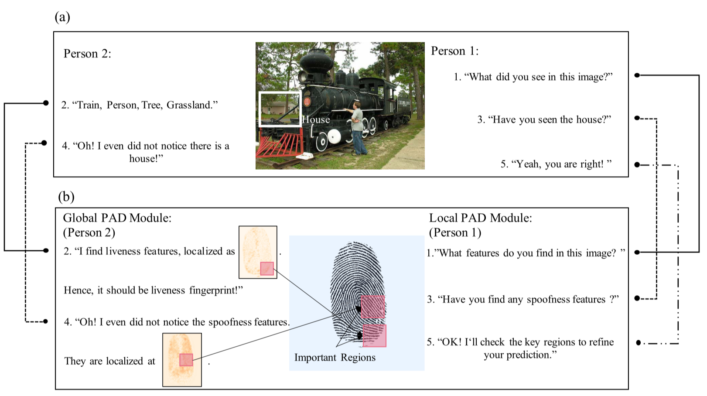
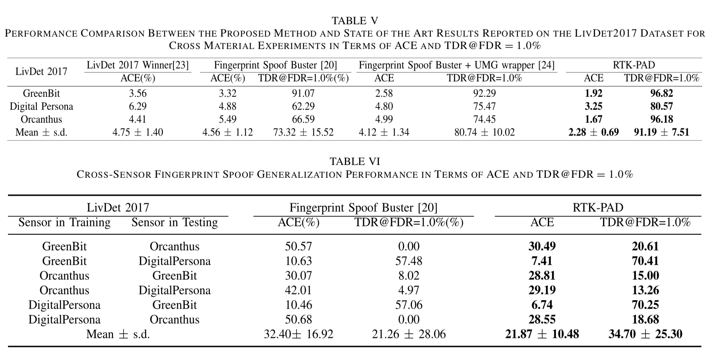

# RTK-PAD
This is an official pytorch implementation of 'Fingerprint Presentation Attack Detector Using Global-Local Model', which is accepted by *IEEE Transactions on Cybernetics*

## Fingerprint Presentation Attack Detector Using Global-Local Model (IEEE TCYB)



* [Paper Link (IEEE)](https://ieeexplore.ieee.org/abstract/document/9457215/)

## Requirements

*   numpy>=1.19.2
*   Pillow>=8.3.2
*   pytorch>=1.6.0
*   torchvision>=0.7.0
*   tqdm>=4.62.2
*   scikit-image>=0.18.3
*   scikit-learn>= 0.24.2
*   matplotlib>=3.4.3
*   opencv-python>= 4.5.3

## Datasets
The proposed method is evaluated on a publicly-available benchmark, i.e. LivDet 2017, and you can download such dataset through [link](https://livdet.org/registration.php)

## Results



## Usage
The RTK-PAD method is trained through three steps:

* Data Preparation

  Generate the image list:
  ```
  python datafind.py \
  --data_path {Your path to save LivDet2017}
  ```
  For example, `python train_local_shuffling.py --data_path /data/fingerprint/2017`
  And then you can get `data_path.txt` to establish a `Dataset Class()` provided by pytorch.

* Pre-trained Model Preparation

  RTK-PAD consists of  Global Classifier and Local Classifier and we use two different initializations for them.

  For Global Classifier, the pre-trained model is carried on ImageNet, and you can download the weights from [Link](https://github.com/d-li14/mobilenetv3.pytorch)

  When it comes to Local Classifier, we propose a self-supervised learning based method to drive the model to learn local patterns. And you can obtain such initialization by
  ```
  python train_local_shuffling.py \
  --sensor [D/G] \
  ```
  `D` refers to `DigitalPersona` and `G` is `GreenBit`. Since `Orcanthus` is with the different sizes of the image, we have a specific implementation for such case, which is hard to merge into this code.

* Training models
  ```
  python train_main.py \
  --train_sensor [D/G] \
  --mode [Patch/Whole] \
  --savedir {Your path to save the trained model} \

  ```

## Evaluation
For evaluation, we can obtain RTK-PAD inference by
```
python evaluation.py \
--test_sensor [D/G]
--global_model_path {Your path to save the global classifier})
--patch_model_path {Your path to save the local classifier}
--patch_num 2 \
```


## Citation
Please cite our work if it's useful for your research.
* BibTex:
```
@article{liu2021fingerprint,
  title={Fingerprint Presentation Attack Detector Using Global-Local Model},
  author={Liu, Haozhe and Zhang, Wentian and Liu, Feng and Wu, Haoqian and Shen, Linlin},
  journal={IEEE Transactions on Cybernetics},
  year={2021},
  publisher={IEEE}
}
```
